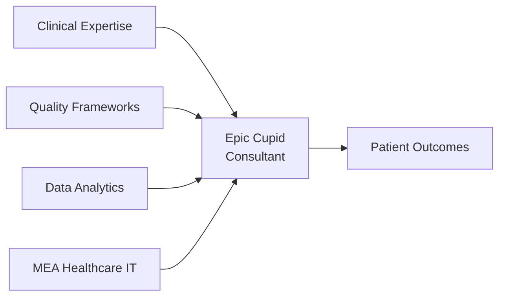
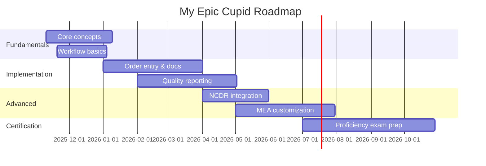
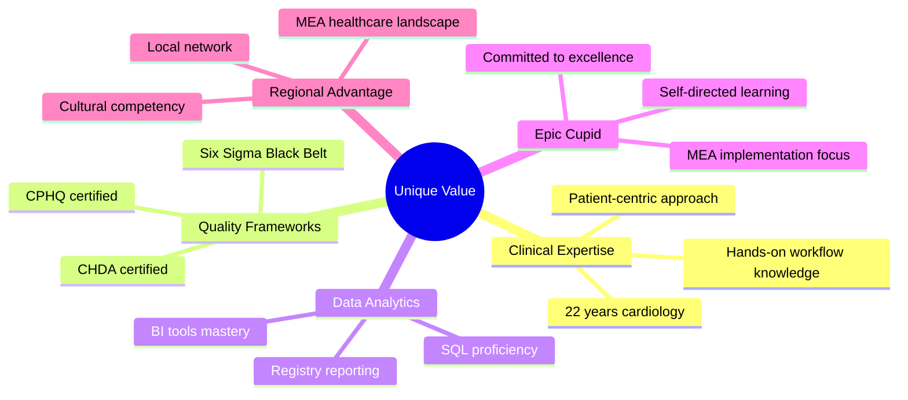

<div align="center">

# 🫀 Tahlil A. Warsame, MSc, CPHQ, CHDA, SSBB

### Cardiovascular Clinical Informatics | Healthcare Quality & Data Analytics Leader

**🎯 Aspiring Epic Cupid Consultant | MEA Region**

[](https://www.linkedin.com/in/tahlilwarsame/)
[](mailto:tahlilw@gmail.com)
[](https://www.kaggle.com/twarsame)


</div>

---

## 🚀 About Me

> *Transforming cardiovascular care through clinical informatics excellence — bridging 22 years of hands-on imaging expertise with data-driven quality improvement.*



**Journey Started:** November 10, 2025 | **Self-Taught** | **Continuous Learner**

---

## 💼 Core Competencies

<table>
<tr>
<td width="50%" valign="top">

### 🏥 Clinical Domain
- ✅ **22 years** cardiovascular imaging
- ✅ End-to-end workflow design
- ✅ DICOM MWL/MPPS integration
- ✅ PACS/VNA optimization
- ✅ Echo & non-invasive labs
- ✅ NCDR registry expertise

</td>
<td width="50%" valign="top">

### 📊 Technical Skills
- ✅ SQL • Power BI • Tableau
- ✅ R programming
- ✅ Quality frameworks (CPHQ, CHDA, SSBB)
- ✅ Data pipeline architecture
- ✅ Registry reporting & analytics
- ✅ Epic Cupid (learning)

</td>
</tr>
</table>

---

## 🎯 What I Do

```yaml
Cardiovascular Workflow Design:
  - Order management & routing
  - DICOM worklist orchestration
  - PACS/VNA integration
  - Clinical documentation optimization
  
Quality Analytics:
  - Report turnaround metrics
  - Data completeness dashboards
  - NCDR registry readiness
  - Capacity & access analytics
  
Epic Cupid Development:
  - Workflow simulation repositories
  - Registry extract prototypes
  - Quality dashboards (de-identified data)
  - MEA implementation planning
```

---

## 📈 Impact Metrics

<div align="center">

| 🎯 Focus Area | 📊 Measurable Outcome |
|---------------|----------------------|
| **Report Turnaround** | Reduced by data-driven workflow redesign |
| **Data Completeness** | Improved through automated quality checks |
| **Registry Readiness** | Enhanced NCDR submission accuracy |
| **Workflow Efficiency** | Optimized order-to-report cycle |

</div>

---

## 🧩 Epic Cupid Learning Journey



---

## 🌍 MEA Healthcare Focus

<div align="center">

### Why MEA Matters

| 🔑 Advantage | 💡 Value Proposition |
|-------------|---------------------|
| **Regional Expertise** | Deep understanding of MEA healthcare landscape |
| **Cultural Competency** | Multilingual capabilities & local network |
| **Clinical + IT** | Rare combination in Epic consulting market |
| **Quality Driven** | Certified methodologies (CPHQ, CHDA, SSBB) |

</div>

---

## 🛠️ Technical Stack

<div align="center">

### Languages & Tools


### Healthcare IT


### Certifications


</div>

---

## 📚 Repository Contents

```
📁 Healthcare-IT-Cardiology-Informatics/
│
├── 📖 01-Fundamentals/
│   ├── Epic Cupid overview
│   ├── Cardiology workflows
│   └── 🎨 Infographics
│
├── ⚙️ 02-Core-Functionality/
│   ├── Order entry systems
│   ├── Clinical documentation
│   └── 🎨 Workflow diagrams
│
├── 🚀 03-Advanced-Workflows/
│   ├── NCDR integration
│   ├── Quality reporting
│   └── 📊 Registry dashboards
│
├── 🔗 04-Integration/
│   ├── HL7 interfaces
│   ├── DICOM workflows
│   └── 🏗️ Architecture diagrams
│
└── 🌍 05-MEA-Implementations/
    ├── Regional considerations
    ├── Case studies
    └── 📋 Implementation guides
```

---

## 🎯 Career Goals

<table>
<tr>
<td width="33%" valign="top">

### 📅 6-12 Months
- ✅ Complete Epic Cupid fundamentals
- ✅ Publish 50+ infographics
- ✅ Network with Epic community
- ✅ Pursue CPHIMS certification

</td>
<td width="33%" valign="top">

### 📅 1-2 Years
- 🎯 Epic Cupid Proficiency
- 🎯 Secure consultant role
- 🎯 Lead first MEA implementation
- 🎯 Contribute to UserWeb

</td>
<td width="33%" valign="top">

### 📅 3-5 Years
- 🚀 MEA Subject Matter Expert
- 🚀 Multi-site deployments
- 🚀 Mentor aspiring consultants
- 🚀 Thought leadership

</td>
</tr>
</table>

---

## 💡 Why Work With Me?

<div align="center">



</div>

---

## 🤝 Let's Connect

<div align="center">

### 💬 Ask Me About:

🫀 **Cardiovascular Workflow Optimization**  
📊 **Clinical Quality Improvement Methodologies**  
📈 **Healthcare Data Analytics & Visualization**  
🎓 **Epic Cupid Self-Learning Journey**  
🌍 **MEA Healthcare IT Landscape**

### 📫 Reach Out

[](https://www.linkedin.com/in/tahlilwarsame/)
[](mailto:tahlilw@gmail.com)

**📍 Location:** MEA Region | **💼 Status:** Open to Epic Cupid Consultant Opportunities

</div>

---

## ⚖️ Legal & Ethical Commitment

<div align="center">

| ✅ Compliance | 📋 Description |
|--------------|---------------|
| **Original Content** | All educational work is self-created |
| **No Proprietary Data** | No Epic Systems confidential content |
| **Privacy Protected** | No PHI or client data included |
| **IP Compliant** | Following Epic intellectual property guidelines |
| **Open Source** | Free for educational use with attribution |

</div>

---

## 📜 License

<div align="center">

[](https://opensource.org/licenses/MIT)
[](http://creativecommons.org/licenses/by-sa/4.0/)

**MIT License** / **CC BY-SA 4.0** — Free for educational use with attribution

</div>

---

## 🙏 Acknowledgments

- **Epic Systems** for transformative healthcare technology
- **Healthcare IT Community** for shared knowledge and support
- **Quality Improvement Methodologies** informing this approach
- **Cardiology Professionals** who've shaped my clinical expertise

---

<div align="center">

### ⭐ Star this repository if you find my journey valuable!

### 🔔 Watch for updates as I progress through Epic Cupid learning

---

**Last Updated:** November 12, 2025

*Transforming cardiovascular care through clinical informatics excellence* 🫀

---


</div>
